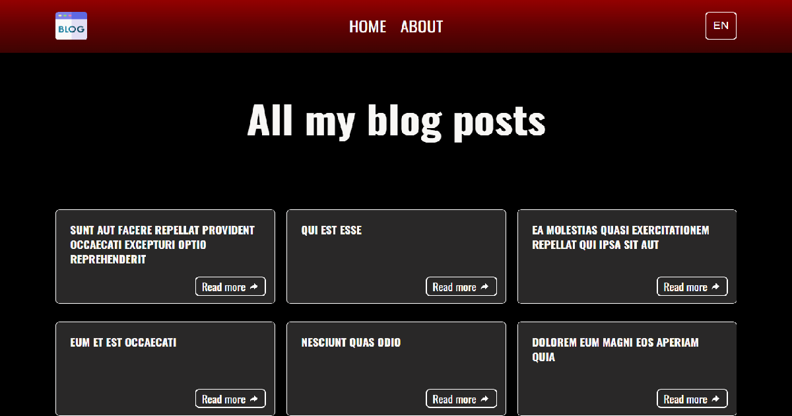

# Mini Blog

Міні-блог з підтримкою багатомовності (EN, UK) на базі Next.js (App Router), локалізації, кастомних Layout, middleware для автоматичного визначення локалі, та простим, чистим дизайном.

---
## 📌 Проєкт

Цей проєкт — демонстрація реалізації сучасного Next.js 13+ з:

- Підтримкою i18n з двома локалями: `en` та `uk`
- Автоматичним визначенням мови через middleware
- Локалізованими сторінками та компонентами
- Використанням Next.js App Router (`app/` директорія)
- Кастомним RootLayout та LocaleLayout для структурування сторінок
- Адаптивним Header та Footer із перекладами
- Обробкою 404 сторінок із локалізацією
- Стилізацією через CSS Modules та Google Fonts (Oswald)

---
## 🚀 Демоверсія

[Відкрити деплой](https://mini-blog-test.vercel.app/)  

---
## 🛠 Технології

- Next.js 13+ (App Router)
- React 18+
- CSS Modules
- Google Fonts (Oswald)
- `@formatjs/intl-localematcher` та `negotiator` — для middleware локалізації
- JSON для словників перекладу
- Node.js, Vercel (для деплою)

---
## 📝 Використання

### Запуск локально

1. Клонувати репозиторій

bash
git clone https://github.com/Ssovelich/mini-blog-test
cd mini-blog

2. Встановити залежності

bash
npm install

yarn install

3. Запустити дев сервер

bash
npm run dev

yarn dev

4. Відкрити в браузері http://localhost:3000
